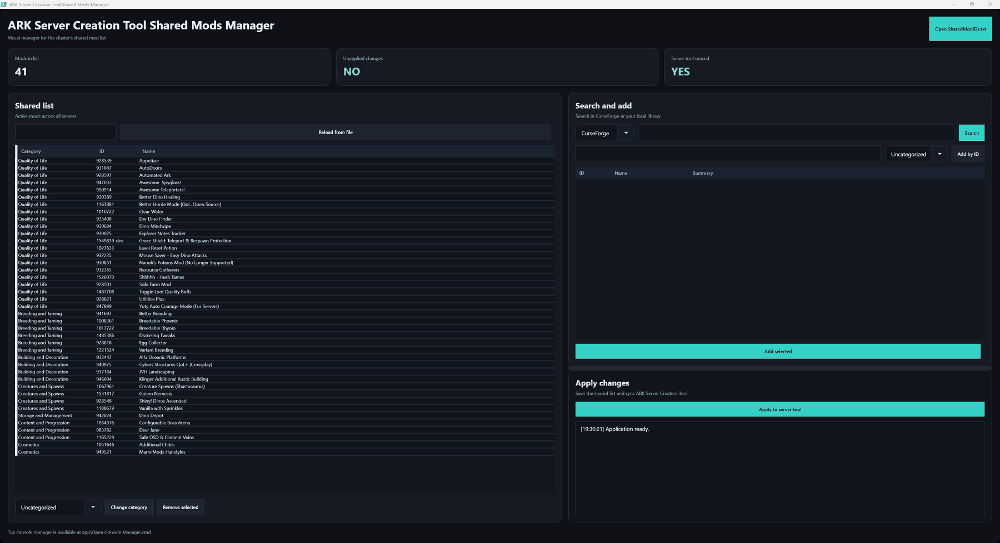

# ARK Shared Mods Manager

Desktop manager for maintaining a readable, categorized shared mod list for ARK: Survival Ascended servers managed through ARK Server Creation Tool.



## Why it exists

Managing server mods directly through raw CurseForge IDs is hard to read and easy to break. A shared server cluster needs the same mod list applied consistently, but it also needs a way to understand what each ID is, search for new mods, remove old ones safely, and avoid manual edits across multiple server configs.

This tool turns that workflow into a visual mod manager.

It is primarily internal tooling for my own ARK Server Creation Tool setup. It is public so the workflow and implementation can be inspected, and it can be adapted by other server owners, but it assumes an ARK Server Creation Tool-style directory layout and config files.

## Features

- Shows mod names instead of only raw IDs.
- Displays and preserves mod categories.
- Reads installed mod metadata from ARK Server Creation Tool's local library.
- Adds mods by CurseForge ID.
- Looks up CurseForge metadata so newly added IDs can get readable names.
- Searches CurseForge from inside the app and adds selected results.
- Searches the local installed-mod library.
- Removes selected mods through the UI instead of editing text files.
- Saves a sorted shared list grouped by category.
- Applies the shared list to every server in `ASCTGlobalConfig.json`.
- Updates `-mods=` in custom launch arguments when servers use them.
- Creates a backup before writing server config changes.
- Shows whether the shared list and server config are currently in sync.
- Restores window size/position between sessions.
- Prevents duplicate app windows.
- Keeps local paths, UI settings, and API keys out of git.

## Local configuration

The scripts do not require the full ARK Server Creation Tool install to live inside this repo.

By default they look for ARK Server Creation Tool at:

```text
C:\Ark\ASCT
```

To override that path, copy:

```text
app\ArkServerCreationToolSharedMods.local.example.json
```

to:

```text
app\ArkServerCreationToolSharedMods.local.json
```

and edit `asctRoot`. The local config is ignored by git.

The CurseForge API key is also kept outside the repo. The tool reads it from `CURSEFORGE_API_KEY` or from ARK Server Creation Tool's existing `Shared/CurseForgeApiKey.txt`.

Window placement is saved locally in:

```text
app\ArkServerCreationToolSharedMods.settings.json
```

That file is also ignored by git.

## Run

Open the UI without leaving a command window open:

```text
ARK Shared Mods Manager.vbs
```

The implementation lives under `app/` so the root folder stays clean.

Open the console manager only when you explicitly want the terminal version:

```bat
app\Open Console Manager.cmd
```
